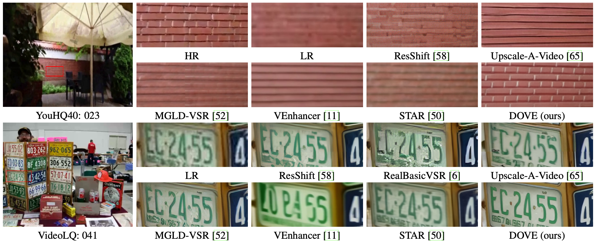

# DOVE: Efficient One-Step Diffusion Model for Real-World Video Super-Resolution

[Zheng Chen](https://zhengchen1999.github.io/), [Zichen Zou](https://github.com/zzctmd), [Kewei Zhang](), [Xiongfei Su](https://ieeexplore.ieee.org/author/37086348852), [Xin Yuan](https://en.westlake.edu.cn/faculty/xin-yuan.html), [Yong Guo](https://www.guoyongcs.com/), and [Yulun Zhang](http://yulunzhang.com/), "DOVE: Efficient One-Step Diffusion Model for Real-World Video Super-Resolution", 2025

<div>
<a href="https://github.com/zhengchen1999/DOVE/releases" target='_blank' style="text-decoration: none;"></a>
<a href="https://github.com/zhengchen1999/DOVE" target='_blank' style="text-decoration: none;"></a>
<a href="https://github.com/zhengchen1999/DOVE/stargazers" target='_blank' style="text-decoration: none;"></a>
</div>


[[arXiv](https://arxiv.org/abs/2505.16239)] [[supplementary material](https://github.com/zhengchen1999/DOVE/releases/download/v1/Supplementary_Material.pdf)] [dataset] [pretrained models]


#### 🔥🔥🔥 News

- **2025-6-09:** Test datasets, inference scripts, and pretrained models are available. ⭐️⭐️⭐️
- **2025-5-22:** This repo is released.

---

> **Abstract:** Diffusion models have demonstrated promising performance in real-world video super-resolution (VSR). However, the dozens of sampling steps they require, make inference extremely slow. Sampling acceleration techniques, particularly single-step, provide a potential solution. Nonetheless, achieving one step in VSR remains challenging, due to the high training overhead on video data and stringent fidelity demands. To tackle the above issues, we propose DOVE, an efficient one-step diffusion model for real-world VSR. DOVE is obtained by fine-tuning a pretrained video diffusion model (*i.e.*, CogVideoX). To effectively train DOVE, we introduce the latent–pixel training strategy. The strategy employs a two-stage scheme to gradually adapt the model to the video super-resolution task.
> Meanwhile, we design a video processing pipeline to construct a high-quality dataset tailored for VSR, termed HQ-VSR. Fine-tuning on this dataset further enhances the restoration capability of DOVE. Extensive experiments show that DOVE exhibits comparable or superior performance to multi-step diffusion-based VSR methods. It also offers outstanding inference efficiency, achieving up to a **28×** speed-up over existing methods such as MGLD-VSR.


---


<table border="0" style="width: 100%; text-align: center; margin-top: 20px;">
  <tr>
    <td>
      <video src="https://github.com/user-attachments/assets/4ad0ca78-6cca-48c0-95a5-5d5554093f7d" controls autoplay loop></video>
    </td>
    <td>
      <video src="https://github.com/user-attachments/assets/e5b5d247-28af-43fd-b32c-1f1b5896d9e7" controls autoplay loop></video>
    </td>
  </tr>
</table>


---

### Training Strategy


---

### Video Processing Pipeline


## 🔖 TODO

- [x] Release testing code.
- [x] Release pre-trained models.
- [ ] Release training code.
- [ ] Release video processing pipeline.
- [ ] Release HQ-VSR dataset.
- [ ] Provide WebUI.
- [ ] Provide HuggingFace demo.

## ⚙️ Dependencies

- Python 3.11
- PyTorch\>=2.5.0
- Diffusers

```bash
# Clone the github repo and go to the default directory 'DOVE'.
git clone https://github.com/zhengchen1999/DOVE.git
conda create -n DOVE python=3.11
conda activate DOVE
pip install -r requirements.txt
pip install diffusers["torch"] transformers
pip install pyiqa
```

## 🔗 Contents

1. [Datasets](#datasets)
1. [Models](#models)
1. Training
1. [Testing](#testing)
1. [Results](#results)
1. [Acknowledgements](#acknowledgements)

## <a name="datasets"></a>📁 Datasets

### 📁 Test Datasets

We provide several real-world and synthetic test datasets for evaluation. All datasets follow a consistent directory structure:

| Dataset |    Type    | # Num |                           Download                           |
| :------ | :--------: | :---: | :----------------------------------------------------------: |
| UDM10   | Synthetic  |  10   | [Google Drive](https://drive.google.com/file/d/1AmGVSCwMm_OFPd3DKgNyTwj0GG2H-tG4/view?usp=drive_link) |
| SPMCS   | Synthetic  |  30   | [Google Drive](https://drive.google.com/file/d/1b2uktCFPKS-R1fTecWcLFcOnmUFIBNWT/view?usp=drive_link) |
| YouHQ40 | Synthetic  |  40   | [Google Drive](https://drive.google.com/file/d/1NqB3lc8j5UqncIPUOjaDBiTor1mmSNm3/view?usp=drive_link) |
| RealVSR | Real-world |  50   | [Google Drive](https://drive.google.com/file/d/1wr4tTiCvQlqdYPeU1dmnjb5KFY4VjGCO/view?usp=drive_link) |
| MVSR4x  | Real-world |  15   | [Google Drive](https://drive.google.com/file/d/16sesBD_9Xx_5Grtx18nosBw1w94KlpQt/view?usp=drive_link) |
| VideoLQ | Real-world |  50   | [Google Drive](https://drive.google.com/file/d/1lh0vkU_llxE0un1OigJ0DWPQwt1i68Vn/view?usp=drive_link) |

All datasets are hosted on [here](https://drive.google.com/drive/folders/1yNKG6rtTNtZQY8qL74GoQwA0jgjBUEby?usp=sharing). Make sure the path is correct (`datasets/test/`) before running inference.

The directory structure is as follows:

```shell
datasets/
└── test/
    └── [DatasetName]/
        ├── GT/         # Ground Truth: folder of high-quality frames (one per clip)
        ├── GT-Video/   # Ground Truth (video version): lossless MKV format
        ├── LQ/         # Low-quality Input: folder of degraded frames (one per clip)
        └── LQ-Video/   # Low-Quality Input (video version): lossless MKV format
```

## <a name="models"></a>📦 Models

We provide pretrained weights for DOVE and DOVE-2B.

| Model Name |               Description               | HuggingFace |                         Google Drive                         | Visual Results                                               |
| :--------- | :-------------------------------------: | :---------: | :----------------------------------------------------------: | ------------------------------------------------------------ |
| DOVE       | Base version, built on CogVideoX1.5-5B; |    TODO     | [Download](https://drive.google.com/drive/folders/1wj9jY0fn6prSWJ7BjJOXfxC0bs8skKbQ?usp=sharing) | [Download](https://drive.google.com/drive/folders/1J92X1amVijH9dNWGQcz-6Cx44B7EipWr?usp=drive_link) |
| DOVE-2B    | Smaller version, based on CogVideoX-2B  |    TODO     |                             TODO                             | TODO                                                         |

> Place downloaded model files into the `pretrained_models/` folder, e.g., `pretrained_models/DOVE`.

## <a name="testing"></a>🔨 Testing

We provide inference commands below. Before running, make sure to download the corresponding pretrained models and test datasets.

For more options and usage, please refer to [inference_script.py](inference_script.py).

The full testing commands are provided in the shell script: [inference.sh](inference.sh).

```shell
# 🔹 Demo inference
python inference_script.py \
    --input_dir datasets/test/UDM10/LQ-Video \
    --model_path pretrained_models/DOVE \
    --output_path results/DOVE/UDM10 \
    --is_vae_st

# 🔹 Reproduce paper results (save as PNGs)
python inference_script.py \
    --input_dir datasets/test/UDM10/LQ-Video \
    --model_path pretrained_models/DOVE \
    --output_path results/DOVE/UDM10 \
    --is_vae_st \
    --png_save

# 🔹 Evaluate quantitative metrics
python eval_metrics.py \
    --gt datasets/test/UDM10/GT \
    --pred results/DOVE/UDM10 \
    --metrics psnr,ssim,lpips,dists,clipiqa
```

> 💡 If you encounter out-of-memory (OOM) issues, you can enable chunk-based testing by setting the following parameters: tile_size_hw, overlap_hw, chunk_len, and overlap_t.
>
> **TODO:** Add metric computation scripts for FasterVQA, DOVER, and $E^*_{warp}$.

## <a name="results"></a>🔎 Results

We achieve state-of-the-art performance on real-world video super-resolution. Visual results are available at [Google Drive](https://drive.google.com/drive/folders/1J92X1amVijH9dNWGQcz-6Cx44B7EipWr?usp=drive_link).

<details open>
<summary>Quantitative Results (click to expand)</summary>

- Results in Tab. 2 of the main paper

<p align="center">
  
</p>

</details>

<details open>
<summary>Qualitative Results (click to expand)</summary>

- Results in Fig. 4 of the main paper

<p align="center">
  
</p>
<details>
<summary>More Qualitative Results</summary>


- More results in Fig. 3 of the supplementary material

<p align="center">
  
</p>


- More results in Fig. 4 of the supplementary material

<p align="center">
  
</p>


- More results in Fig. 5 of the supplementary material

<p align="center">
  
  
</p>


- More results in Fig. 6 of the supplementary material

<p align="center">
  
  
</p>


- More results in Fig. 7 of the supplementary material

<p align="center">
  
  
</p>

</details>

</details>

## <a name="citation"></a>📎 Citation

If you find the code helpful in your research or work, please cite the following paper(s).

```
@article{chen2025dove,
  title={DOVE: Efficient One-Step Diffusion Model for Real-World Video Super-Resolution},
  author={Chen, Zheng and Zou, Zichen and Zhang, Kewei and Su, Xiongfei and Yuan, Xin and Guo, Yong and Zhang, Yulun},
  journal={arXiv preprint arXiv:2505.16239},
  year={2025}
}
```

## <a name="acknowledgements"></a>💡 Acknowledgements

This project is based on [CogVideo](https://github.com/THUDM/CogVideo) and [Open-Sora](https://github.com/hpcaitech/Open-Sora).

